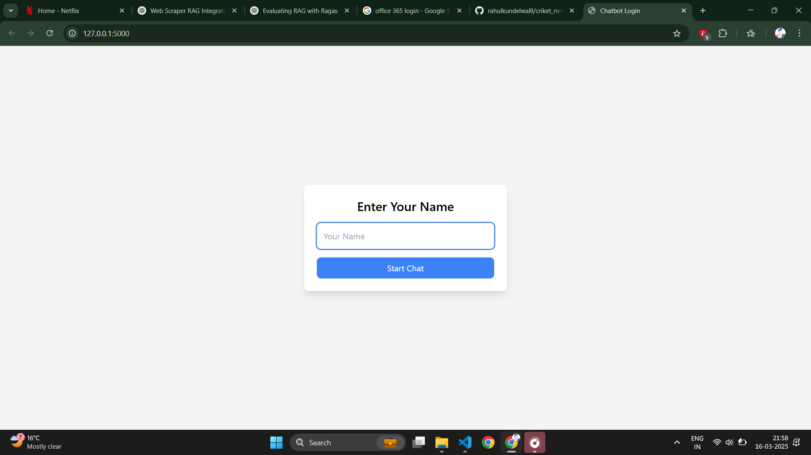
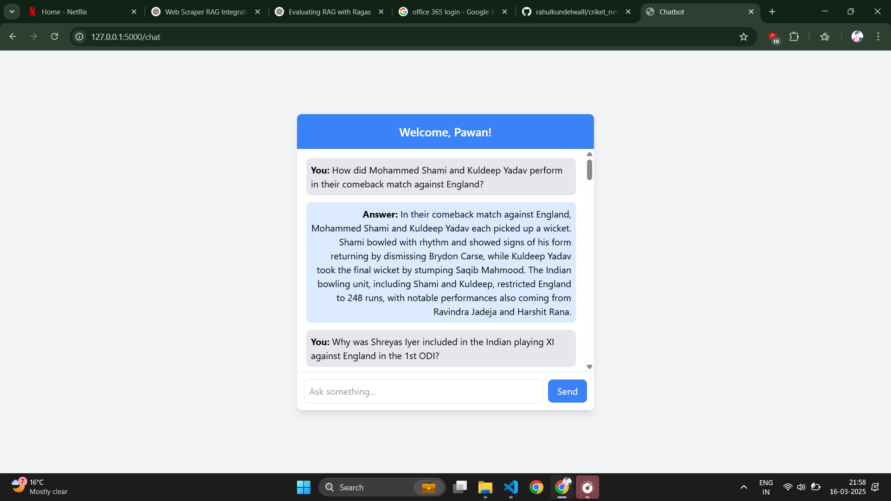

# RAG-Based Cricket Chatbot

## Introduction

This project is a **Retrieval-Augmented Generation (RAG)**-based chatbot designed to provide accurate cricket-related responses by retrieving relevant information before generating answers using OpenAI's GPT models.

## Table of Contents

- [What is RAG?](#what-is-rag)
- [What is OpenAI?](#what-is-openai)
- [How the Chatbot Works](#how-the-chatbot-works)
- [Threshold Tuning](#threshold-tuning)
- [Project Structure](#project-structure)
- [Installation and Setup](#installation-and-setup)
- [Running the Chatbot](#running-the-chatbot)
- [Customization](#customization)
- [Conclusion](#conclusion)

---

## What is RAG?

Retrieval-Augmented Generation (RAG) is an advanced AI technique that enhances language models by integrating a retrieval mechanism before generating responses. It consists of:

1. **Retrieval Component**: Searches a document store or knowledge base to fetch relevant information.
2. **Generation Component**: Uses a language model (e.g., OpenAI GPT) to generate responses based on retrieved data.

This approach improves response accuracy, ensures factual correctness, and enhances contextual understanding.

## What is OpenAI?

[OpenAI](https://openai.com/) is an AI research and deployment company that develops state-of-the-art language models such as GPT (Generative Pre-trained Transformer). In this chatbot, OpenAI’s GPT is used for:

- Understanding and processing user queries.
- Generating responses augmented with retrieved information.
- Ensuring natural and conversational interactions.

---

## How the Chatbot Works

The chatbot operates in the following steps:

### 1. **User Query Processing**

- The user enters a query related to cricket.
- The query undergoes preprocessing (text normalization, tokenization, etc.).

### 2. **Retrieval Phase**

- The processed query is converted into an embedding.
- A similarity search is performed in the document store to fetch relevant cricket-related information.

### 3. **Augmentation Phase**

- The retrieved data is formatted and combined with the original query.
- The augmented query is sent to the OpenAI GPT model.

### 4. **Response Generation**

- GPT generates a response using both retrieved data and its internal knowledge.
- The response is post-processed before being sent to the user.

### 5. **Threshold Tuning**

- A similarity threshold is used to decide whether retrieved information is relevant.
- If the similarity score is below the threshold, fallback mechanisms are triggered.

---

## Threshold Tuning

The chatbot uses a **retrieval threshold** to determine when to use retrieved data.

- **Higher threshold** (e.g., 0.85 - 0.9): More accurate but may reject some relevant queries.
- **Lower threshold** (e.g., 0.6 - 0.7): More inclusive but might allow less relevant responses.

You can configure the threshold in `config.py`:

```python
RETRIEVAL_THRESHOLD = 0.8  # Adjust based on performance needs
```

---

## Project Structure

The key components of the chatbot are:

```
RAG_Pipeline/
│-- server.py            # Main server to handle user interactions
│-- Split_data_in_chunk  # Split data into chunks
│-- chromaDBRetriber    # store data into chromadb
│-- Rag.py               #Retive data feed to llm
```

---

## Installation and Setup

### 1. Clone the repository:

```bash
git clone https://github.com/rahulkundelwalll/criket_news_chatbot
cd  criket_news_chatbot/Assignment
```

### 2. Install dependencies:

```bash
pip install -r requirements.txt
```

### 3. Set up environment variables (API keys, paths, etc.) in `.env`:

```python
OPENAI_API_KEY = "your-api-key"
```

---

## Running the Chatbot

To start the chatbot, run the following command in the `RAG_Pipeline` directory:

```bash
python server.py
```

The chatbot will be available at `http://localhost:5000` (or the configured port).

---



## Customization

### 1. **Modify Retrieval Parameters**

Adjust retrieval settings in `ChromaDBRetriber.py`:

```python
def retrieve_documents(query, top_k=5):
    # Fetch top_k relevant documents
```

### 2. **Enhance Prompt Engineering**

Modify prompts in `Rag.py` to refine response generation:

```python
prompt_template = """
Use the following information to answer the user’s query:
{retrieved_info}
Query: {query}
Response:
"""
```

### 3. **Expand the Knowledge Base**

Add more cricket-related documents to `data/` to improve retrieval quality.

## Conclusion

This RAG-based cricket chatbot combines retrieval and generative AI techniques to provide accurate and contextually relevant responses. By fine-tuning the retrieval threshold, expanding the knowledge base, and refining the prompt engineering, the chatbot can be further optimized for better performance.
